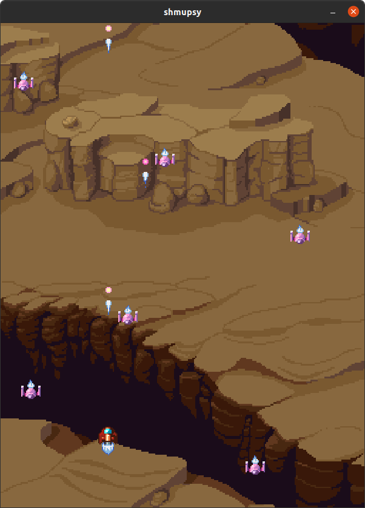

# shmupsy
A simple shoot 'em up game, used as a means to experiment with [SDL](https://www.libsdl.org/).

---------------------------------------------------

## Building and Running

The current build configuration is intended to target Linux only (for now).
```
git clone https://github.com/deforde/sdl-test
cd shmupsy && mkdir build && cd build
cmake .. -DCMAKE_BUILD_TYPE=Release
cmake --build . --target shmupsy
```

---------------------------------------------------

### Dependencies

- [SDL2](https://www.libsdl.org)
- [SDL2 Image](https://www.libsdl.org/projects/SDL_image)


```
apt install libsdl2-dev libsdl2-image-dev
```

---------------------------------------------------

### Assets

- https://ansimuz.itch.io/spaceship-shooter-environment

---------------------------------------------------


